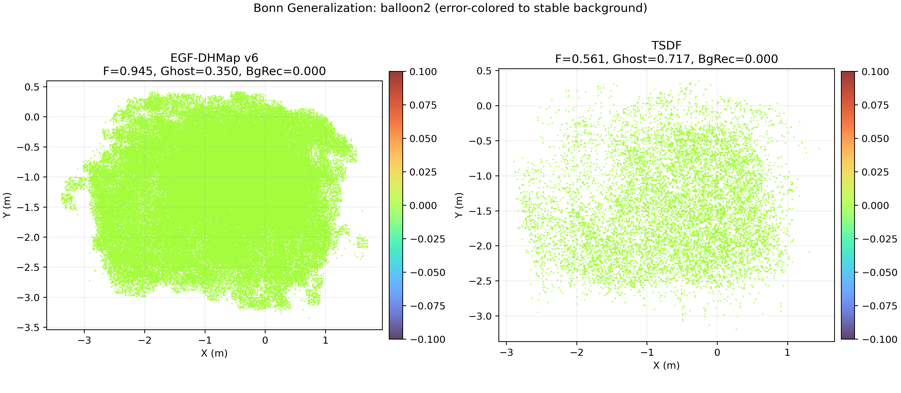
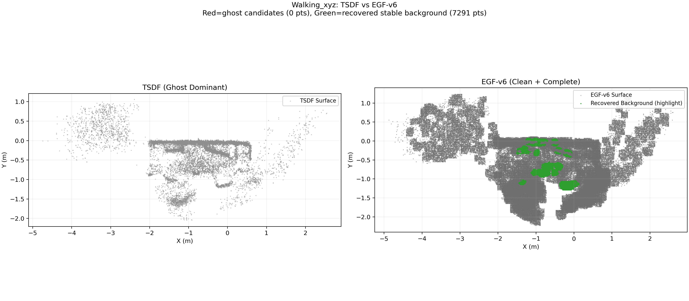

# EGF-DHMap: Evidence-Gradient Field Dynamic Mapping


EGF-DHMap 是一个面向动态场景的 3D 隐式建图原型：
- 使用证据场 `rho` 的时序累积进行动静分离（Time-Adaptive）；
- 使用梯度场约束保持几何一致性；
- 在不启用激进清理（`dyn_forget_gain=0`）时仍具备较强 Ghost 抑制能力。

合并文档入口：`MERGED_DOCS.md`（包含 README、设计、实现、基准与数据说明）。

> 当前仓库已完成结构精简：早期 2D/CGPM legacy 代码目录已移除，仅保留 3D 主线实现与复现实验脚本。

## 核心结果（置顶）

### Bonn 泛化结果（高动态）
在 `rgbd_bonn_balloon2` 上：
- EGF: `F-score = 0.9452`
- TSDF: `F-score = 0.5612`
- 相对提升：`(0.9452 - 0.5612) / 0.5612 = 68.4%`（约 69%）



### TUM 论文级对比图


### Static 场景修复（freiburg1_xyz）
- 问题：EGF 在纯静态场景精度低于 TSDF。
- 修复：引入静态专用提取参数（仅作用于 `run_benchmark.py` 的 static 分支）。
- 结果：EGF `F-score 0.8416 -> 0.9054`，`Precision 0.7266 -> 0.8712`，`Chamfer 0.0464 -> 0.0435`。
- 验证：3 个动态序列指标保持不变（无回归）。
- 结果目录：`output/post_cleanup/static_fix_fullverify/`
- 差分汇总：`output/summary_tables/static_fix_delta_summary.csv`

## Quick Start

### 1) 一行命令跑 TUM 基准（EGF vs TSDF）
```bash
/home/zzy/anaconda3/envs/cgpm/bin/python scripts/run_benchmark.py --dataset_kind tum --dataset_root data/tum --out_root output/post_cleanup/benchmark_tum --frames 80 --stride 3 --max_points_per_frame 3000 --voxel_size 0.02 --eval_thresh 0.05 --ghost_thresh 0.08 --bg_thresh 0.05 --methods egf,tsdf,simple_removal --force
```

### 2) 一行命令跑时间维机理实验
```bash
/home/zzy/anaconda3/envs/cgpm/bin/python scripts/run_temporal_ablation.py --dataset_root data/tum --sequence rgbd_dataset_freiburg3_walking_xyz --frames_list 15,30,45,60,90,120 --stride 3 --max_points_per_frame 3000 --voxel_size 0.02 --eval_thresh 0.05 --bg_thresh 0.10 --out_root output/post_cleanup/temporal_ablation --curve_png assets/temporal_convergence_curve.png --rho_png assets/temporal_rho_evolution.png --force
```

### 3) 一行命令跑 Bonn 泛化实验
```bash
/home/zzy/anaconda3/envs/cgpm/bin/python scripts/run_benchmark_bonn.py --dataset_root data/bonn --sequence rgbd_bonn_balloon2 --frames 80 --stride 3 --max_points_per_frame 3000 --voxel_size 0.02 --eval_thresh 0.05 --bg_thresh 0.10 --out_root output/post_cleanup/benchmark_bonn --compare_png assets/bonn_comparison.png --force
```

### 4) 一键刷新 `output/summary_tables`
```bash
/home/zzy/anaconda3/envs/cgpm/bin/python scripts/update_summary_tables.py --verbose
```

## 项目结构（精简后）
- `egf_dhmap3d/`: 3D 核心实现（数据结构、预测、关联、更新、评估）。
- `scripts/`: 实验与绘图入口（benchmark/temporal/bonn/ablation）。
- `data/`: TUM 与 Bonn 数据目录。
- `assets/`: 论文级图表。
- `output/post_cleanup/`: 删除 legacy 后的全量复现结果。
- `output/summary_tables/`: 最终汇总 CSV（推荐对外分发）。

## 当前推荐入口脚本
- `scripts/run_benchmark.py`: 通用基准入口（支持 `--dataset_kind tum|bonn|auto`）
- `scripts/run_temporal_ablation.py`: 时间维机理分析（收敛曲线 + rho 演化）
- `scripts/run_benchmark_bonn.py`: Bonn 动态序列专项对比

## 结果文件
- 主报告：`BENCHMARK_REPORT.md`
- 合并总文档：`MERGED_DOCS.md`
- TUM 汇总：`output/summary_tables/tum_reconstruction_metrics.csv`, `output/summary_tables/tum_dynamic_metrics.csv`
- TUM 静态修复专项：`output/summary_tables/tum_reconstruction_metrics_static_fix.csv`, `output/summary_tables/tum_dynamic_metrics_static_fix.csv`
- 时间维 CSV：`output/summary_tables/temporal_ablation_summary.csv`
- Bonn CSV：`output/summary_tables/bonn_summary.csv`
- 消融 CSV：`output/summary_tables/ablation_summary.csv`
- 时间收敛图：`assets/temporal_convergence_curve.png`
- rho 演化图：`assets/temporal_rho_evolution.png`
- Bonn 对比图：`assets/bonn_comparison.png`
