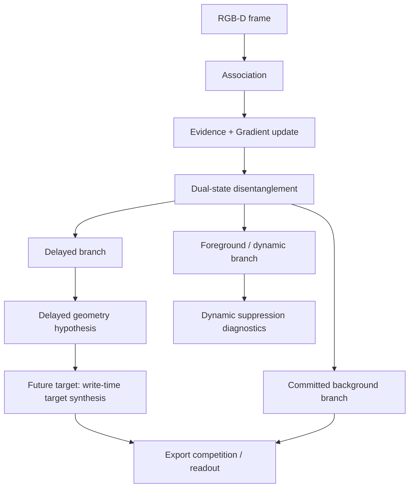

# S1 主方法结构图（文字版）

```mermaid
flowchart TD
    A[RGB-D frame] --> B[Association]
    B --> C[Evidence + Gradient update]
    C --> D[Dual-state disentanglement]
    D --> E[Committed background branch]
    D --> F[Delayed branch]
    D --> G[Foreground / dynamic branch]
    F --> H[Delayed geometry hypothesis]
    H --> I[Future target: write-time target synthesis]
    I --> J[Export competition / readout]
    E --> J
    G --> K[Dynamic suppression diagnostics]
```

## 图示解释
- 主文核心只保留：
  - `evidence-gradient`
  - `dual-state disentanglement`
  - `delayed branch`
  - `write-time target synthesis`
- 其余模块在当前阶段只作为 supporting diagnostics chain。
