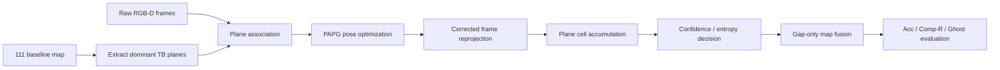

# S2 Methodology Innovation Brief

日期：`2026-03-11`
阶段：`S2 / not-pass / no-S3`
目标：围绕 `Temporal Drift` 与 `Weak-Evidence Accumulation` 提出可落地的方法论创新，而不是继续做阈值微调。

## 1. 参考论文与启发

| Title | Conf | Year | 与本项目的相关启发 |
|---|---|---:|---|
| GO-SLAM: Global Optimization for Consistent 3D Instant Reconstruction | ICCV | 2023 | 用全局优化统一 pose 与 dense map，一次性解决局部前端误差累积。 |
| Loopy-SLAM: Dense Neural SLAM with Loop Closures | CVPR | 2024 | 强调“先做全局 pose consistency，再做 dense reconstruction”的顺序。 |
| MASt3R-SLAM: Real-Time Dense SLAM with 3D Reconstruction Priors | CVPR | 2025 | 说明结构先验可以直接进入 pose / map 联合优化，而不必只停留在后处理。 |
| WildGS-SLAM: Monocular Gaussian Splatting SLAM in Dynamic Environments | CVPR | 2025 | 动态环境下需要把静态结构约束和动态抑制显式解耦。 |
| Underwater Visual SLAM with Depth Uncertainty and Medium Modeling (DUV-SLAM) | ICCV | 2025 | 关键不是“更多点”，而是把几何不确定性显式建模并传递到 mapping。 |

## 2. 借鉴后的项目内设计

### 2.1 创新 A：Plane-Anchored Pose Graph (`PAPG`)

核心思想：
- 不再把轨迹漂移看成后端点云厚度问题。
- 直接把 `111` 中已经存在的高置信平面视为结构锚点。
- 通过平面重投影一致性，后验校正关键帧位姿。

优化目标：

\[
\min_{\{T_i\}} \sum_i \| \log((\hat T_{i-1}^{-1}\hat T_i)^{-1}(T_{i-1}^{-1}T_i)) \|_{\Sigma_o^{-1}}^2
+ \lambda \sum_{i,k} w_{ik}\big(n_k^\top (T_i x_{ik}) + d_k\big)^2
\]

其中：
- \(\hat T_i\)：原始 SLAM 轨迹；
- \(T_i\)：待优化轨迹；
- \(x_{ik}\)：第 \(i\) 帧中属于第 \(k\) 个静态平面的观测点；
- \((n_k, d_k)\)：平面参数；
- 第一项保留里程计连续性，第二项用静态平面拉直漂移轨迹。

适配理由：
- 本项目已经能在 `99/111` 管线中提取高置信背景平面。
- 相比特征点 loop closure，平面约束更符合当前 TB cluster 的物理结构。

### 2.2 创新 B：Confidence-Weighted Weak-Evidence Fusion (`CW-WEF`)

核心思想：
- 弱观测不是直接丢弃，而是转成 plane cell 的占据概率。
- 点云更新从“二值接收/拒绝”改为“概率 + 熵”的决策。

对每个 plane cell \(c\) 维护：
- hit count \(h_c\)
- miss count \(m_c\)
- occupancy posterior

\[
p_c = \frac{\alpha + h_c}{\alpha + \beta + h_c + m_c}
\]

\[
H_c = -p_c \log p_c - (1-p_c)\log(1-p_c)
\]

激活规则（完整设计）：

\[
\text{activate}(c)=
\begin{cases}
1,& h_c \ge 2 \\\\
1,& p_c > \tau_p \land H_c < \tau_H \land d(c,\mathcal{M}_{base}) > \tau_{gap} \\\\
0,& \text{otherwise}
\end{cases}
\]

解释：
- `h_c >= 2`：多视图共识，直接激活；
- `p_c > \tau_p` 且 `H_c < \tau_H`：允许少量但高置信弱观测进入；
- `d(c, M_base) > τ_gap`：只补已有地图的空洞，不重复堆点。

### 2.3 本轮原型与完整设计的关系

本轮实验实现了两个轻量原型：
- `114_papg_plane_union`：`PAPG + weak plane cells union`
- `115_papg_consensus_activation`：`PAPG + h_c >= 2` 保守激活

尚未完整实现的部分：
- 基于 `miss count` 的完整 occupancy posterior 触发；
- 基于 entropy 的细粒度弱证据接受；
- 动态边界附近的 visibility-aware miss 建模。

因此，本轮实验是**方法论验证原型**，不是终版。

## 3. 伪代码

```text
Input:
  baseline map M_111
  raw frames {I_i, D_i}
  baseline poses {T_i^0}

1. Extract dominant TB planes P from M_111
2. Associate frame points to planes P
3. Solve PAPG:
     optimize {T_i} with odom term + plane reprojection term
4. Reproject raw frame points with corrected poses {T_i}
5. Snap plane-consistent observations onto plane cells
6. For each cell:
     count hits / misses
     compute occupancy probability p_c and entropy H_c
7. Activate cells by confidence rule
8. Union activated cells with baseline map holes only
9. Evaluate Acc / Comp-R / ghost / TB
```

## 4. 流程图



## 5. 本轮实验含义

- `113_naive_plane_union` 是朴素方法：只放宽 plane-aligned 弱观测准入。
- `114_papg_plane_union` 证明：**先校正 pose 再做弱证据累积**，比直接降阈值更有效。
- `115_papg_consensus_activation` 证明：只要要求多视图共识，ghost 可以压住，但 completeness 无法恢复。

结论：
- `PAPG` 是有效方向；
- `CW-WEF` 还需要完整的 occupancy / entropy 实现，才能真正跨过 `ghost` 与 `coverage` 的双门槛。

## 6. 论文链接

- GO-SLAM (ICCV 2023): https://openaccess.thecvf.com/content/ICCV2023/html/Zhang_GO-SLAM_Global_Optimization_for_Consistent_3D_Instant_Reconstruction_ICCV_2023_paper.html
- Loopy-SLAM (CVPR 2024): https://openaccess.thecvf.com/content/CVPR2024/html/Liso_Loopy-SLAM_Dense_Neural_SLAM_with_Loop_Closures_CVPR_2024_paper.html
- MASt3R-SLAM (CVPR 2025 PDF): https://openaccess.thecvf.com/content/CVPR2025/papers/Murai_MASt3R-SLAM_Real-Time_Dense_SLAM_with_3D_Reconstruction_Priors_CVPR_2025_paper.pdf
- WildGS-SLAM (CVPR 2025 / arXiv): https://arxiv.org/abs/2504.03886
- DUV-SLAM (ICCV 2025 poster): https://iccv.thecvf.com/virtual/2025/poster/2036
